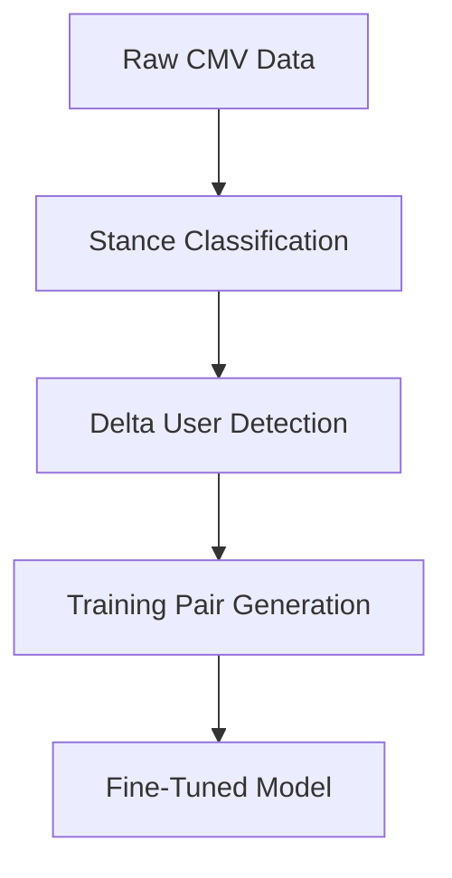

# Fine-Tuning Guide for CMV Debate System

This comprehensive guide explains the complete fine-tuning pipeline for training debate models on Change My View (CMV) conversation data using LoRA (Low-Rank Adaptation).

## Overview

The fine-tuning system trains language models to generate persuasive debate responses by learning from successful arguments in CMV conversations. The system uses stance classification and evidence from delta-awarded users to create high-quality training data.

## Quick Start

```bash
# 1. Run stance classification (if not already done)
python src/add_stance_classification.py --input data/raw_conversations.json --output data/cmv_10_conversation_trees.json

# 2. Quick test fine-tuning
python src/fine_tune_model.py --config quick_test.yml

# 3. Full production training
python src/fine_tune_model.py --config default.yaml
```

## Dataset: `cmv_10_conversation_trees.json`

The core dataset contains 10 CMV conversations with hierarchical tree structures representing threaded discussions.

### Structure

```json
{
  "conversation_id": "t3_2ro9ux",
  "title": "CMV: Anything that is man-made is natural.",
  "op_text": "Original post content...",
  "tree": [
    {
      "id": "t3_2ro9ux",
      "speaker": "seanyowens",
      "text": "Comment text...",
      "stance": "support",  // Added by stance classification
      "children": [...]     // Nested replies
    }
  ]
}
```

### Key Features

- **Hierarchical Structure**: Preserves parent-child relationships between comments
- **Stance Classification**: Each node has `stance` property ("support", "refute", "NO_STANCE")
- **Rich Metadata**: Speaker names, IDs, and full conversation context
- **Delta Tracking**: Contains DeltaBot confirmations for view changes

### Statistics

- **10 conversations** covering diverse topics
- **1,280+ individual responses** with stance classifications
- **100% delta coverage** - all conversations contain successful view changes
- **High-quality arguments** from users who changed minds

### Data Processing Pipeline



## Stance Classification: `add_stance_classification.py`

Automatically classifies the stance of each comment relative to the original post using sentence similarity.

### How It Works

1. **Sentence Similarity**: Uses SentenceTransformer (`all-MiniLM-L6-v2`) to encode texts
2. **Cosine Similarity**: Compares each comment with the original post
3. **Threshold-Based Classification**:
   - Similarity ≥ 0.3 → "support" (agrees with OP)
   - Similarity < 0.3 → "refute" (disagrees with OP)
4. **Batch Processing**: Optimized for efficiency with vectorized operations

### Usage

```bash
# Basic usage
python src/add_stance_classification.py

# Custom model and files
python src/add_stance_classification.py \
  --input data/raw_conversations.json \
  --output data/classified_conversations.json \
  --model all-MiniLM-L6-v2
```

### Output

- Adds `stance` property to each conversation tree node
- Maintains original tree structure and relationships
- Provides confidence scores and reasoning for classifications

## Fine-Tuning Script: `fine_tune_model.py`

Trains debate models using LoRA on the stance-classified CMV data with evidence from delta-awarded users.

### Key Features

#### Delta-Awarded Evidence

The script identifies users who received deltas (successful view changers) and uses their arguments as evidence:

```python
def find_delta_awarded_users(tree_nodes):
    """Find users who were awarded deltas by DeltaBot"""
    # Searches for DeltaBot confirmations like:
    # "Confirmed: 1 delta awarded to /u/Account9726"
    # Extracts the convincing user's text as evidence
```

#### Training Data Generation

Creates prompt-response pairs with:

- **Claim**: Extracted from CMV title
- **Evidence**: Text from delta-awarded users (most persuasive arguments)
- **Stance**: From similarity-based classification
- **Context**: Recent debate history
- **Response**: Actual user response from conversation

#### Example Training Prompt

```
Claim: "Anything that is man-made is natural."
Evidence: "Look at the definition you provided, if we remove the exclusion of things which humans create: existing in nature. So essentially, by this definition, 'natural things' are 'things that exist,' which is frankly rather meaningless..."

Your role is to refute the claim using the evidence and respond thoughtfully to your opponent's arguments.
Reference specific points where appropriate, and try to persuade a neutral judge.
Limit your response to 3 sentences.

Debate so far:
Agent R: I can't remember the topic that spurred this discussion...

Agent R: 
```

### LoRA Configuration

- **Target Modules**: `["q", "v", "k", "o", "wi", "wo"]` (T5 attention and FFN)
- **Rank (r)**: 16 for efficient adaptation
- **Alpha**: 32 for scaling
- **Dropout**: 0.1 for regularization
- **Trainable Parameters**: ~1.8% of total model (4.6M out of 252M)

### Usage

```bash
# Quick test with minimal data
python src/fine_tune_model.py --config quick_test.yml

# Full training with default config
python src/fine_tune_model.py --config default.yaml
```

## Configuration Files

Located in `config/finetune/`, these YAML files control all training parameters.

### `quick_test.yml` - Fast Development

```yaml
model:
  name: "google/flan-t5-base"
  output_dir: "models/flan-t5-base-cmv-debate-lora"

data:
  path: "data/cmv_10_conversation_trees.json"
  max_samples: 2          # Limited for quick testing
  max_input_length: 256
  max_target_length: 256

training:
  batch_size: 2
  learning_rate: 0.0001
  num_epochs: 1           # Single epoch for speed
  gradient_accumulation_steps: 2
  warmup_steps: 100

lora:
  r: 16
  lora_alpha: 32
  lora_dropout: 0.1
  target_modules: ["q", "v", "k", "o", "wi", "wo"]
```

### `default.yaml` - Full Training

```yaml
model:
  name: "google/flan-t5-large"    # Larger model
  output_dir: "models/flan-t5-large-cmv-debate-lora"

data:
  max_samples: null              # Use all conversations
  max_input_length: 512         # Longer context
  max_target_length: 256

training:
  batch_size: 4
  learning_rate: 5e-5
  num_epochs: 3                  # More training
  gradient_accumulation_steps: 4
  warmup_steps: 500

evaluation:
  skip_evaluation: false
  eval_steps: 100
  save_steps: 100
```

## Training Pipeline

### 1. Data Preprocessing

```python
# Load and extract training pairs
train_data, val_data = preprocess_data(data_path, max_samples)

# Creates prompt-response pairs with:
# - Claim from CMV title
# - Evidence from delta-awarded users
# - Stance-based role assignment
# - Conversation context
```

### 2. Model Setup

```python
# Load base model (FLAN-T5)
model = AutoModelForSeq2SeqLM.from_pretrained(model_name)

# Apply LoRA adaptation
lora_config = LoraConfig(
    task_type=TaskType.SEQ_2_SEQ_LM,
    r=16, lora_alpha=32, lora_dropout=0.1,
    target_modules=["q", "v", "k", "o", "wi", "wo"]
)
model = get_peft_model(model, lora_config)
```

### 3. Training

```python
# Fine-tune with HuggingFace Trainer
trainer = Trainer(
    model=model,
    args=training_args,
    train_dataset=train_dataset,
    eval_dataset=val_dataset,
    data_collator=data_collator,
)
trainer.train()
```

### 4. Evaluation

- Generates sample responses on test data
- Compares against original human responses
- Evaluates stance consistency and argument quality

## Component Overview

### Core Scripts

| Script | Purpose | Input | Output |
|--------|---------|-------|--------|
| `add_stance_classification.py` | Classify comment stances | Raw conversations | Stance-classified data |
| `fine_tune_model.py` | Train debate models | Classified data + config | Fine-tuned model |

### Configuration Files

| File | Purpose | Use Case |
|------|---------|----------|
| `config/finetune/quick_test.yml` | Fast development | Quick experiments |
| `config/finetune/default.yaml` | Production training | Full model training |

### Models and Outputs

| Directory | Contains | Description |
|-----------|----------|-------------|
| `models/` | Fine-tuned models | LoRA adapters + tokenizers |
| `results/` | Training logs | Metrics and evaluation results |

## Best Practices

### Data Quality

- **Use Delta-Awarded Evidence**: Prioritizes most persuasive arguments
- **Filter Short Responses**: Removes low-quality, brief comments
- **Maintain Context**: Preserves conversation flow and history
- **Stance Consistency**: Ensures coherent argument direction

### Training Efficiency

- **LoRA Adaptation**: Reduces training time and memory usage
- **Gradient Accumulation**: Enables larger effective batch sizes
- **Mixed Precision**: Uses fp16 when available for speed
- **Configuration-Driven**: Easy experimentation with different parameters

### Model Selection

- **FLAN-T5-Base**: For quick experiments and development
- **FLAN-T5-Large**: For production-quality results
- **Custom Models**: Easy to adapt for other T5 variants

## Performance Metrics

### Dataset Statistics

- **Support responses**: ~10-15% of total
- **Refute responses**: ~85-90% of total
- **Delta coverage**: 100% (all conversations have successful view changes)
- **Average conversation depth**: 4-5 levels

### Training Results

- **Training time**: ~5-10 minutes (quick_test) to 2-4 hours (full)
- **Memory usage**: 4-8GB GPU memory (depending on model size)
- **Convergence**: Typically 1-3 epochs for good results

## Results and Outputs

### Model Artifacts

- **LoRA Adapters**: Saved in `models/` directory
- **Tokenizer**: Saved with model for consistency
- **Training Logs**: Detailed progress and metrics
- **Checkpoints**: Periodic saves for recovery

### Performance Metrics

- **Training Loss**: Convergence tracking
- **Evaluation Loss**: Generalization assessment
- **Sample Generations**: Qualitative evaluation
- **Stance Accuracy**: Argument direction consistency

## Advanced Usage

### Custom Datasets

```python
# Adapt for new conversation data
def extract_debate_training_pairs(conversation_data):
    # Modify for different data formats
    # Ensure stance property exists
    # Adapt evidence extraction logic
```

### Model Variants

```yaml
# In config file
model:
  name: "google/flan-t5-xl"        # Larger model
  # or
  name: "t5-large"                 # Standard T5
  # or 
  name: "google/flan-t5-small"     # Smaller for speed
```

### Hyperparameter Tuning

```yaml
training:
  learning_rate: [1e-5, 5e-5, 1e-4]  # Try different rates
  batch_size: [2, 4, 8]              # Adjust for GPU memory
  num_epochs: [1, 3, 5]              # Balance training time vs quality
```

## Troubleshooting

### Common Issues

| Problem | Solution |
|---------|----------|
| Out of memory | Reduce batch_size or max_input_length |
| Slow training | Use smaller model or reduce data size |
| Poor quality | Check evidence extraction and stance classification |
| Import errors | Install requirements: `pip install -r requirements.txt` |

### Detailed Solutions

1. **CUDA Out of Memory**
   - Reduce `batch_size` or `max_input_length`
   - Use gradient accumulation for effective larger batches
   - Switch to smaller model variant

2. **Poor Convergence**
   - Adjust learning rate (try 1e-5 to 1e-4 range)
   - Increase warmup steps
   - Check data quality and filtering

3. **Inconsistent Stance**
   - Verify stance classification quality
   - Check evidence extraction from delta users
   - Ensure prompt template clarity

4. **Slow Training**
   - Use `quick_test.yml` for development
   - Enable fp16 training
   - Reduce max sequence lengths

### Debug Commands

```bash
# Check data quality
python -c "
import json
with open('data/cmv_10_conversation_trees.json') as f:
    data = json.load(f)
print(f'Conversations: {len(data)}')
"

# Test stance classification
python src/add_stance_classification.py --input data/sample.json --output /tmp/test.json

# Quick training test
python src/fine_tune_model.py --config quick_test.yml
```

### Performance Optimization

1. **Data Loading**
   - Use appropriate `num_workers` in DataLoader
   - Cache tokenized data for repeated experiments
   - Filter conversations without deltas if needed

2. **Memory Management**
   - Use gradient checkpointing for large models
   - Clear cache between experiments
   - Monitor GPU utilization

3. **Training Speed**
   - Use larger batch sizes with gradient accumulation
   - Enable mixed precision training
   - Consider model parallelism for very large models

## Integration with Debate System

The fine-tuned models integrate with the broader debate system:

1. **Model Loading**: Load LoRA adapters with base model
2. **Response Generation**: Use trained model for debate responses
3. **Stance Conditioning**: Condition generation on desired stance
4. **Context Integration**: Incorporate debate history and evidence

## File Structure

```
config/
├── finetune/
│   ├── quick_test.yml        # Fast development config
│   └── default.yaml          # Production config

src/
├── add_stance_classification.py  # Stance classification script
├── fine_tune_model.py            # Fine-tuning script
└── [other scripts]

data/
├── cmv_10_conversation_trees.json  # Main dataset
└── [other data files]

models/
└── [fine-tuned model outputs]

docs/
├── fine_tuning_guide.md      # This file
└── api_reference.md          # Detailed API documentation
```

## Examples

### Running Stance Classification

```bash
python src/add_stance_classification.py \
  --input data/raw_conversations.json \
  --output data/classified_conversations.json
```

### Fine-Tuning a Model

```bash
# Quick test
python src/fine_tune_model.py --config quick_test.yml

# Full training
python src/fine_tune_model.py --config default.yaml
```

This fine-tuning pipeline creates models specifically optimized for persuasive debate response generation, learning from the most successful arguments in real CMV discussions.
